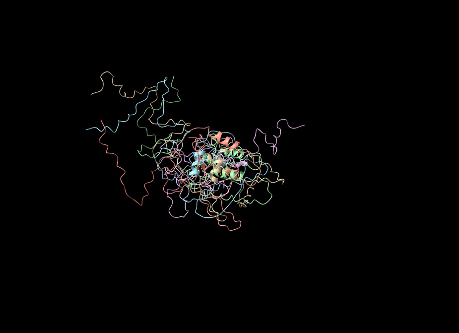

# In Silico Vaccine Design Automation

A Nextflow-based pipeline for automated epitope-based vaccine design using protein sequences from NCBI. This pipeline supports multiple pathogens and is currently tested on measles, rubella, and mumps viruses using dynamic accession-based inputs.

## Overview

This pipeline automates the in silico design of multi-epitope vaccines by integrating:
1. Protein sequence retrieval from NCBI
2. B-cell epitope prediction
3. T-cell epitope prediction (MHC class I & II)
4. Epitope filtering and ranking
5. Vaccine construct assembly with linkers
6. Evaluation of immunological and physicochemical properties
7. Optional: Molecular dynamics (MD) simulation via Collab2Fold and ChimeraX

Originally inspired by the methodology of:
> Tambunan et al. Vaccine Design for H5N1 Based on B- and T-cell Epitope Predictions. *Bioinformatics and Biology Insights* 2016:10 27-35.

## Requirements

- Nextflow (>=21.10)
- Container technology (optional but recommended):
  - Docker or Singularity
- R (>=4.0) packages:
  - Biostrings
  - rentrez
  - seqinr
  - httr
- Python (>=3.8) packages:
  - biopython
  - pandas
  - numpy
  - requests

## Quick Start

```bash
# Clone this forked repository
git clone https://github.com/putriimnida/automated-insilico-vaccinedesign.git
cd automated-insilico-vaccinedesign

# Run with default parameters
./run_pipeline.sh

# Run with custom parameters
./run_pipeline.sh 
# Check the Default values
# ACCESSION1="ABK40530.1" -> change it to desired, valid protein accession number
# ACCESSION2="NP_740664.1" -> change it to desired, valid protein accession number

# Run on a SLURM cluster
./run_pipeline.sh --profile slurm
```

## Pipeline Parameters

You can run the pipeline with different parameters:

| Parameter         | Description                                             | Default              |
|------------------|---------------------------------------------------------|----------------------|
| `--accession1`    | First protein accession number (e.g. surface antigen)  | `'ABK40530.1'`       |
| `--accession2`    | Second protein accession number (e.g. envelope/fusion) | `'NP_740664.1'`      |
| `--outdir`        | Base output directory for all results                  | `results`            |
| `--experiment_id` | Unique identifier for this experiment run              | `exp1`               |
| `--profile`       | Execution profile (e.g. `local`, `slurm`, `docker`)   | `local`              |
| `--run_md`        | Enable molecular dynamics simulation                   | `false`              |
| `--resume`        | Resume from a previously cached run                    | `false`              |
| `--verbose`       | Enable detailed logging output                         | `false`              |
| `--help`          | Show pipeline help message                             | `false`              |

## Output Structure

The pipeline generates a structured output directory for each experiment:

```
results/
└── results_<experiment_id>/
    ├── reports/                    # Pipeline reports (DAG, execution timeline)
    ├── epitopes/                  # Predicted and filtered epitopes
    │   └── accession1/, accession2/
    ├── vaccine/                   # Vaccine FASTA and HTML reports
    ├── evaluation/                # Property and immune evaluations
    └── molecular_dynamics/       # MD results (if enabled)

```

## Customization

Edit nextflow.config to:
Change default accessions (tested and validated)
Add custom HLA alleles (customization under development)
Switch epitope prediction tools (customization under development)
Modify epitope thresholds or linker design (customization under development)

Run on terminal: bash run_pipeline.sh


## Structural Visualization

The image below shows the predicted 3D structure of the measles-rubella multi-epitope vaccine construct, generated with AlphaFold and visualized in ChimeraX:



*Figure: Ribbon structure with color-coded secondary elements and highlighted core regions.*


## Advanced Usage

### Using different prediction methods

The pipeline supports multiple epitope prediction methods:

- B-cell: Bepipred-1.0, Bepipred-2.0, Chou-Fasman, Emini, Karplus-Schulz, Kolaskar-Tongaonkar, Parker
- T-cell: NetMHCpan, NetMHCIIpan

You can modify these in the nextflow.config file.

### Running on HPC clusters

The pipeline is designed to work with high-performance computing clusters:

```bash
# Run on SLURM cluster
./run_pipeline.sh --profile slurm --experiment_id hpc_run
```

## Troubleshooting

If you encounter issues:

1. Check that all required Python scripts exist in the `bin/` directory
2. Verify that the necessary Python and R packages are installed
3. Check the log files in `results/results_<experiment_id>/reports/` for errors
4. Use the `--verbose` flag for more detailed logging
